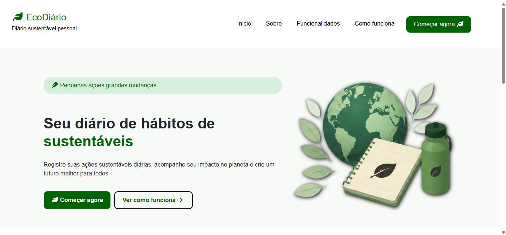

# Eco Diário

Eco Diário é um projeto front-end desenvolvido com HTML, CSS e JavaScript com foco em sustentabilidade e conscientização ambiental. A aplicação apresenta uma interface moderna e responsiva para exibir informações relacionadas ao meio ambiente e hábitos sustentáveis.

## Tecnologias Utilizadas

* HTML5
* CSS3
* JavaScript

## Funcionalidades

* Interface responsiva
* Layout moderno
* Navegação simples
* Seções informativas sobre sustentabilidade

## Objetivo

O projeto foi desenvolvido para praticar desenvolvimento front-end e criar uma aplicação com temática sustentável.

